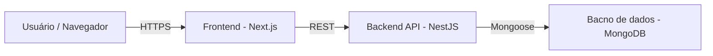

# 📘 Documento de Arquitetura de Software

## 1. Visão Geral

**Nome do Sistema:** VipCore  
**Descrição Resumida:** Plataforma de Gestão para Grupos de Networking, indicações e geração de negócios.  
**Autor:** Gabriel Xavier da Silva   
**Data:**  Novembro/2025

## 2. Objetivos e Contexto

### 2.1. Objetivos do Sistema
- Centralizar cadastro e gestão de membros.
- Facilitar organização de encontros e controle de presença.
- Promover geração e acompanhamento de oportunidades de negócio entre membros.
- Conectar membros através de indicações, avaliações e agradecimentos.
- Substituir planilhas por relatórios, notificações e dashboards. 
- Controle financeiro de mensalidades centralizado e padronizado.

### 2.2. Escopo

#### Fluxo de Admissão de Membros

1. Página de Intenção: Página pública com um formulário simples contendo
campos como Nome, Email, Empresa e Motivo de participação. 

2. Área do Administrador: Area privada onde um administrador possa:
- Ver a lista de todas as intenções submetidas.
- Aprovar ou Recusar cada intenção.

3. Cadastro Completo: Após aprovação de uma intenção, o sistema gera um convite direcionando para página de cadastro mais completa.

#### Sistema de Indicações

- Funcionalidade para um membro (logado) criar uma indicação de negócio para outro membro.
- Formulário com informações de membro indicado, empresa indicada, descrição da oportunidade.
- Página de visualização das indicações que fez e as que recebeu, e atualizar o status de cada uma ( Nova, Em Contato, Fechada, Recusada).
- Realizar agradecimentos em indicações recebidas.

#### Dashboard de Performance

- Página privada que exiba um dashboard simples com os Indicadores de membros ativos, Indicações feitas no mês e total de agradecimentos.

#### Comunicação e Engajamento

- Área de avisos e comunicados para os membros.
- Controle de presença em reuniões (check-in).

#### Acompanhamento e Performance

- Controle de reuniões 1 a 1 entre membros.
- Dashboards de desempenho individual e do grupo.
- Relatórios por período (semanal, mensal, acumulado).

#### Financeiro

- Módulo de controle de mensalidades (geração, status de pagamento).

### 2.3. Stakeholders

| Papel                    |       Nome       | Responsabilidade                      |
| ------------------------ | ---------------- | ------------------------------------- |
| Cliente                  |   AG Sistemas    | Fornecer requisitos, validar entregas |
| Product Owner            |  Gabriel Xavier  | Priorizar backlog                     |
| Arquiteto                |  Gabriel Xavier  | Decisões arquiteturais                |
| Dev Frontend             |  Gabriel Xavier  | Next.js                               |
| Dev Backend              |  Gabriel Xavier  | Nest.JS                                |
| DBA                      |  Gabriel Xavier  | MongoDB                               |
| Usuários finais          | Membros do grupo | Usar plataforma para networking       |

## 3. Requisitos

### 3.1. Requisitos Funcionais
- RF01 – Cadastro de Intenção de participação  
- RF02 – Página de Aprovação/Recusa de intenções
- RF03 - Envio de noticação de aprovação
- RF04 - Cadastro de membros aprovados  
- RF05 - Envio de avisos e comunicados para membros
- RF06 - Indicação de oportunidades de negócios
- RF07 - Listar indicações
- RF08 - Administradores podem aprovar/recusar indicações
- RF09 - Membros podem atualizar status de indicações
- RF10 - Dashboard de indicadores com total de membros, indicações e agradecimentos

### 3.2. Requisitos Não Funcionais
- RNF01 – FrontEnd em Next.js e React 
- RNF02 – Backend com framework Node.js
- RNF03 – Banco de Dados MongoDB  
- RNF04 - Testes em Jest
- RNF05 - Utilizazção de variáveis de ambiente
- RNF06 - Segurança por token
- RNF07 - Autenticação de aprovação através de token único

## 4. Visão de Alto Nível

### 4.1. Diagrama da Arquitetura



### 4.2. Modelo de Dados

A escolha do MongoDB como banco de dados deu se devido a alta compatibilidade com Nest.js 

- users - membros e adminstradores
- messages - avisos e comunicados
- meetings - reuniões
- attendances - registros de presença / check-ins
- opportunities - indicações de negócios
- notifications - notificações do sistemas
- invoices - mensalidades

### 🧍‍♂️ `users` — Membros e Administradores

| Campo          | Tipo     | Descrição                                                  | Exemplo                  |
|----------------|----------|------------------------------------------------------------|--------------------------|
| `_id`          | ObjectId | Identificador único do usuário                             | `"675a888b1234567890"`   |
| `name`         | String   | Nome completo do usuário                                   | `"Gabriel Xavier"`       |
| `email`        | String   | Email                                                      | `"gabriel@grupo.com"`    |
| `passwordHash` | String   | Senha criptografada                                        | `"hashed_password"`      |
| `role`         | String   | Função do usuário (`ADMINISTRADOR`, `MEMBRO`)              | `"MEMBRO"`               |
| `status`       | String   | Situação da adesão (`PENDENTE`, `APROVADO`, `REJEITADO`)   | `"PENDENTE"`             |
| `reason`       | String   | Motivação de ingresão                                      | `"Networking"`           |
| `enterprise`   | String   | Empresa representada                                       | `"TechX"`                |
| `CNPJ`         | String   | CNPJ da empresa                                            | `"12.345.678/0001-12"`   |
| `active`       | Boolean  | Indica se o membro está ativo                              | `true`                   |
| `appraiser`    | ObjectId | Avaliador de adesão (Aprovação/rejeição)                   | `"675a888b1234567890"`   |
| `createdAt`    | Date     | Data de criação                                            | `"2025-01-15T12:00:00Z"` |
| `updateAt`     | Date     | Data de alteração                                          | `"2025-01-15T12:00:00Z"` |
| `updatedBy`    | ObjectId | Usuário da alteração                                       | `"675a888b1234567890"`   |


### 💬 `messages` — Avisos e Comunicados

| Campo       | Tipo     | Descrição                                            | Exemplo                           |
|-------------|----------|------------------------------------------------------|-----------------------------------|
| `_id`       | ObjectId | Identificador único da mensagem                      | `"675a999b1234567890"`            |
| `title`     | String   | Título do comunicado                                 | `"Reunião Extraordinária"`        |
| `content`   | String   | Texto da mensagem                                    | `"Teremos reunião amanhã às 9h."` |
| `target`    | String   | Público-alvo (`TODOS`, `ADMINISTRADORES`)            | `"TODOS"`                         |
| `createdBy` | ObjectId | ID do usuário que criou o aviso                      | `"675a888b1234567890"`            |
| `updatedBy` | ObjectId | ID do usuário que alterou o aviso                    | `"675a888b1234567890"`            |
| `createdAt` | Date     | Data de publicação                                   | `"2025-11-01T10:00:00Z"`          |
| `updateAt`  | Date     | Data de alteração                                    | `"2025-01-15T12:00:00Z"`          |

### 📅 `meetings` — Reuniões

| Campo         | Tipo     | Descrição                                            | Exemplo                                 |
|---------------|----------|------------------------------------------------------|-----------------------------------------|
| `_id`         | ObjectId | Identificador da reunião                             | `"675a777b1234567890"`                  |
| `title`       | String   | Título da reunião                                    | `"Reunião Semanal de Networking"`       |
| `description` | String   | Pauta da reunião                                     | `"Apresentações e novas oportunidades"` |
| `date`        | Date     | Data e hora                                          | `"2025-11-10T09:00:00Z"`                |
| `location`    | String   | Local ou link remoto                                 | `"Sala 2"`                              |
| `status`      | String   | `AGENDADA`, `EM PROGRESSO`, `CONCLUÍDA`, `CANCELADA` | `"Sala 2"`                              |
| `createdBy`   | ObjectId | Usuário criador                                      | `"675a888b1234567890"`                  |
| `updatedBy`   | ObjectId | Usuário alterador                                    | `"675a888b1234567890"`                  |
| `createdAt`   | Date     | Data de publicação                                   | `"2025-11-01T10:00:00Z"`                |
| `updateAt`    | Date     | Data de alteração                                    | `"2025-01-15T12:00:00Z"`                |

### ✅ `attendances` — Registros de Presença / Check-ins

| Campo         | Tipo     | Descrição                 | Exemplo                  |
|---------------|----------|---------------------------|--------------------------|
| `_id`         | ObjectId | Identificador do check-in | `"675a111b1234567890"`   |
| `meetingId`   | ObjectId | ID da reunião             | `"675a777b1234567890"`   |
| `userId`      | ObjectId | ID do membro presente     | `"675a888b1234567890"`   |
| `checkInTime` | Date     | Horário de registro       | `"2025-11-10T09:05:00Z"` |
| `status`      | String   | `PRESENTE`, `ATRASADO`    | `"PRESENTE"`             |

---

### 💼 `opportunities` — Indicações de Negócios

| Campo         | Tipo     | Descrição                            | Exemplo                                   |
|---------------|----------|--------------------------------------|-------------------------------------------|
| `_id`         | ObjectId | Identificador da indicação           | `"675a222b1234567890"`                    |
| `fromUser`    | ObjectId | Membro que gerou a indicação         | `"675a888b1234567890"`                    |
| `toUser`      | ObjectId | Membro indicado                      | `"675a555b1234567890"`                    |
| `description` | String   | Descrição da oportunidade            | `"Contato com empresa ABC para proposta"` |
| `status`      | String   | `ENVIADA`, `EM ANDAMENTO`, `FECHADA` | `"ENVIADA"`                               |
| `createdBy`   | ObjectId | Usuário criador                      | `"675a888b1234567890"`                    |
| `updatedBy`   | ObjectId | Usuário alterador                    | `"675a888b1234567890"`                    |
| `createdAt`   | Date     | Data de publicação                   | `"2025-11-01T10:00:00Z"`                  |
| `updateAt`    | Date     | Data de alteração                    | `"2025-01-15T12:00:00Z"`                  |

---

### 🔔 `notifications` — Notificações do Sistema

| Campo         | Tipo     | Descrição                                          | Exemplo                                        |
|---------------|----------|----------------------------------------------------|------------------------------------------------|
| `_id`         | ObjectId | Identificador da notificação                       | `"675a444b1234567890"`                         |
| `userId`      | ObjectId | Usuário destinatário                               | `"675a888b1234567890"`                         |
| `type`        | String   | Tipo (`MENSALIDADE`, `REUNIÃO`, `AVISO`)           | `"MENSALIDADE"`                                |
| `title`       | String   | Título curto                                       | `"Pagamento Pendente"`                         |
| `message`     | String   | Detalhe da notificação                             | `"Sua mensalidade de novembro está pendente."` |
| `createdAt`   | Date     | Data de publicação                                 | `"2025-11-01T10:00:00Z"`                       |

### 💳 `invoices` — Mensalidades

| Campo            | Tipo     | Descrição                                          | Exemplo                  |
|------------------|----------|----------------------------------------------------|--------------------------|
| `_id`            | ObjectId | Identificador da cobrança                          | `"675a555b1234567890"`   |
| `userId`         | ObjectId | Membro cobrado                                     | `"675a888b1234567890"`   |
| `referenceMonth` | String   | Mês/ano de referência                              | `"2025-11"`              |
| `amount`         | Number   | Valor da mensalidade                               | `150.00`                 |
| `dueDate`        | Date     | Data de vencimento                                 | `"2025-11-15T00:00:00Z"` |
| `status`         | String   | `À VENCER`, `PAGA`, `ATRADADA`, `CANCELADA`        | `"À VENCER"`             |
| `paidAt`         | Date     | Data do pagamento                                  | `"2025-11-12T14:30:00Z"` |
| `createdBy`      | ObjectId | Usuário criador                                    | `"675a888b1234567890"`   |
| `updatedBy`      | ObjectId | Usuário alterador                                  | `"675a888b1234567890"`   |
| `createdAt`      | Date     | Data de publicação                                 | `"2025-11-01T10:00:00Z"` |
| `updateAt`       | Date     | Data de alteração                                  | `"2025-01-15T12:00:00Z"` |

### 🧩 Relacionamentos Entre Coleções

- **`users`** 1 — N **`attendances`**
- **`users`** 1 — N **`opportunities`**
- **`users`** 1 — N **`notifications`**
- **`users`** 1 — N **`invoices`**
- **`meetings`** 1 — N **`attendances`**

### 4.3 🧱 Estrutura de Componentes (Front-end)

```bash
src/
├── app/
│ ├── layout.tsx        # Layout global (Navbar, Sidebar, Footer)
│ ├── page.tsx          # Página de login (login e inscrição)
| ├── register.tsx      # Formulário de inscrição 
│ ├── members/          # Rotas relacionadas a membros
│ │ ├── page.tsx        # Página Inicial de membros (dashboard/resumo)
│ ├── meetings/         # Rotas de reuniões
│ ├── opportunities/    # Rotas de indicações
│ ├── invoices/         # Rotas do módulo financeiro
│ ├── messages/         # Comunicados
│
├── components/
│ ├── ui/       # Componentes visuais reutilizáveis (botões, modais, inputs)
│ ├── forms/    # Componentes de formulários (ex: MemberForm, InvoiceForm)
│ ├── layout/   # Navbar, Sidebar, Header, Footer
│ ├── cards/    # Cards de exibição (MemberCard, MeetingCard, etc.)
│ ├── tables/   # Listagens com filtros e paginação
│ └── feedback/ # Toasters, Alertas, Loaders
│
├── hooks/    # Custom hooks (ex: useAuth, useFetch, useInvoices)
├── context/  # Contextos globais (autenticação, tema, notificações)
├── store/    # Estado global com Zustand (opcional)
├── services/ # Comunicação com API (Axios ou Fetch)
│ ├── api.ts  # Configuração base (ex: axios.create)
│ ├── membersService.ts
│ ├── meetingsService.ts
│ ├── invoicesService.ts
| ├── messagesService.ts
│ └── authService.ts
│
├── utils/  # Funções auxiliares (formatadores, validações)
├── types/  # Tipagens e interfaces TypeScript
└── styles/ # Configurações globais de estilo
```

### 4.4 Definição da API

### 🔑 Autenticação

**Base URL:** `/api/v1/auth`

| Método | Rota              | Descrição                              | Request                                                                     | Response                                                   |
|--------|-------------------|----------------------------------------|-----------------------------------------------------------------------------|------------------------------------------------------------|
| `POST` | `/login`          | Login do usuário e geração do token JWT| `{ "email": "", "password": "" }`                                           |`"data":{"token":"", "user": { "_id": "...", "role": "" } }`|
| `POST` | `/register`       | Cadastro inicial de novo usuário       | `{ "name": "", "email": "", "password": "", "enterprise": "", "reason":"" }`|`"message": "Cadastro enviado para avaliação"`              |
| `PATCH`| `/forgotPassword` | Alterar senha                          | `{ "email": "", "password": "" }`                                           |`"message": "Procedimento enviado para email cadastrado"`   |

### 🧍‍♂️ Usuários (`/api/v1/users`)

Gerencia membros e administradores do grupo.

| Método   | Rota          | Descrição                          | Request                                     | Response                                                                             |
|----------|---------------|------------------------------------|---------------------------------------------|--------------------------------------------------------------------------------------|
| `GET`    | `/`           | Lista todos os usuários (admin)    | —                                           | `"data": [ { "_id": "...", "name": "...", "role": "member" } ]`                      |
| `GET`    | `/:id`        | Busca um usuário específico        | —                                           | `"data": { "_id": "...", "name": "Gabriel Xavier", "membershipStatus": "approved" }` |
| `PATCH`  | `/status/:id` | Aprova/Recusa membro               | `{"_id": "", "status": ""}`                 | `"message": "Avaliação Realizada"`                                                   |
| `PATCH`  | `/:id`        | Atualiza dados de perfil           | `{"name": "", "enterprise": "","CNPJ": ""}` | `"message": "Atualizado com sucesso"`                                                |
| `DELETE` | `/:id`        | Remove um usuário (soft delete)    | —                                           | `"message": "Usuário desativado"`                                                    |

**Observações:**
- Novos cadastros entram com `status: "PENDENTE"`.  
- Apenas `admins` podem aprovar ou rejeitar (`status: "APROVADO" | "REPROVADO"`).  
- Senhas são armazenadas criptografadas.

### 📅 Reuniões (`/api/v1/meetings`)

Gerencia as reuniões e permite registrar presenças (check-ins).

| Método   | Rota   | Descrição                      | Request                                                         | Response                                                                                      |
|----------|--------|--------------------------------|-----------------------------------------------------------------|-----------------------------------------------------------------------------------------------|
| `GET`    | `/`    | Lista todas as reuniões        | —                                                               | `"data": [ {"_id": "","title": "","date": "","location": ""}]`                                |
| `GET`    | `/:id` | Detalha uma reunião específica | —                                                               | `"data": {"_id": "","title": "","description": "","date": "","location": "","createdBy": "" }`|
| `POST`   | `/`    | Cria uma nova reunião          | `{ "title": "", "description": "", "date": "", "location": "" }`| `"message": "Reunião criada"`                                                                 |
| `PATCH`  | `/:id` | Atualiza dados da reunião      | `{ "title": "", "description": "", "date": "", "location": "" }`| `"message": "Reunião atualizada"`                                                             |
| `DELETE` | `/:id` | Remove reunião (soft delete)   | —                                                               | `"message": "Reunião cancelada"`                                                              |

#### ✅ Check-ins de Presença (`/api/v1/attendances`)

| Método  | Rota          | Descrição                                      | Request                                   | Response                                  |
|---------|---------------|------------------------------------------------|-------------------------------------------|-------------------------------------------|
| `POST`  | `/`           | Registra presença de um usuário em uma reunião | `{ "meetingId": "...", "userId": "..." }` | `"message": "Check-in realizado"`         |
| `GET`   | `/:meetingId` | Lista presenças de uma reunião                 | —                                         | `"data": [ { "name": "", "status": "" } ]`|

### 💳 Mensalidades (`/api/v1/invoices`)

Gerencia as cobranças mensais dos membros e controle de pagamentos.

| Método  | Rota          | Descrição                                            | Request                           | Response                                                          |
|---------|---------------|------------------------------------------------------|-----------------------------------|-------------------------------------------------------------------|
| `GET`   | `/`           | Lista todas as cobranças                             | —                                 | `"data": [ { "_id": "", "amount": 0, "status": "" } ]`            |
| `GET`   | `/:id`        | Detalha uma cobrança específica                      | —                                 | `"data": { "_id": "", "amount": 0, "dueDate": "", "status": "" }` |
| `POST`  | `/generate`   | Gera cobranças mensais para todos os membros ativos  | `{ "referenceMonth": "2025-11" }` | `"message": "Mensalidades geradas"`                               |
| `PATCH` | `/:id/pay`    | Marca uma cobrança como paga (manual ou via webhook) | `{ "status": "PAGA" }`            | `"message": "Pagamento confirmado"`                               |
| `PATCH` | `/:id/cancel` | Cancela uma cobrança                                 | —                                 | `"message": "Cobrança cancelada"`                                 |

### 🔔 Notificações (`/api/v1/notifications`)

| Método | Rota        | Descrição                                 | Request | Response                                                                     |
|--------|-------------|-------------------------------------------|---------|------------------------------------------------------------------------------|
| `GET`  | `/:userId`  | Lista notificações do usuário autenticado | —       | `"data": [ { "title": "Mensalidade", "message": "Pagamento Pendente", "type":"" } ]` |

### 🧩 Padrões de Resposta

Todas as respostas seguem um formato padronizado:

```json
{
  "success": true,
  "data": { ... },
  "message": "Operação realizada com sucesso"
}
```
Erros retornam:
```json
{
  "success": false,
  "message": "Erro ao processar requisição"
}
```
## 5. Detalhamento Técnico

### 5.1. Tecnologias Utilizadas
- Linguagem: JavaScript e TypeScript
- Banco de Dados: MongoDB
- Front-end: Next.js / React
- Back-end: Nest.js

### 5.2. Padrões e Princípios
- SOLID  
- Clean Architecture  
- RESTful APIs 
- POO 
- DDD

## 6. Segurança
- Autenticação via JWT  
- Criptografia para dados sensíveis  
- Políticas de acesso por papel  

## 7. Implantação e Infraestrutura

### 7.1. Ambientes
| Ambiente    | Descrição       |  URL / Host | Observações |
| ----------- | --------------- | ------------| ----------- |
| Development | Desenvolvimento |    .dev     |    ...      |
| Homolog     | Testes internos |    .homolog |    ...      |
| master      | Produção        |    .com     |    ...      |

### 7.2. Deploy
- Commits de alterações em Development -> homolog -> master
- Merge em homolog para validações
- Pull Request de homolog para master
- Utilização de Migrations


## 8. Monitoramento e Logs
- Registro de todas as operações no banco de dados  

## 9. Futuras Evoluções 
- Suporte a OAuth2 (login com Google, LinkedIn) para facilitar onboarding.
- Checkin por QR Code / Localização GPS
- Logs de operações registradas no banco
- Agrupamento de membros por empresa
- Aprimorar notificações de acordo com o veiculo de comunicação
- Criação de Grupos de membros


